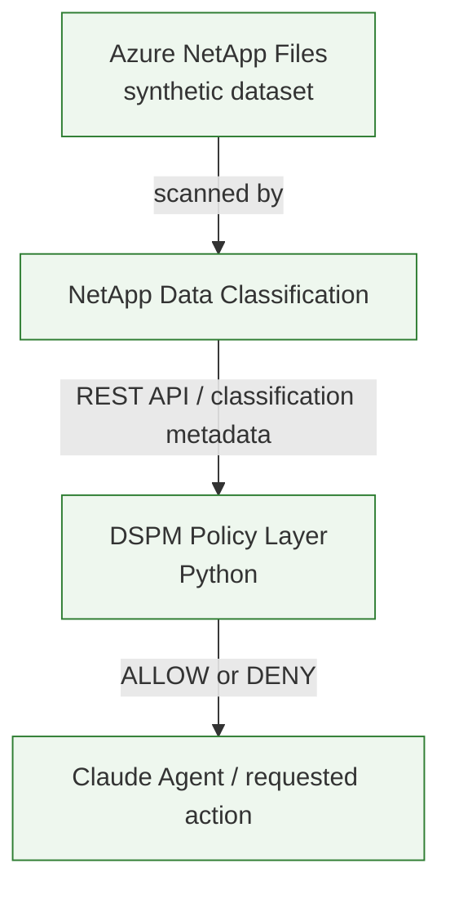
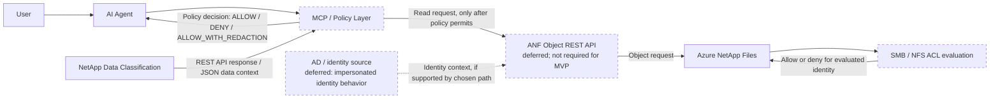
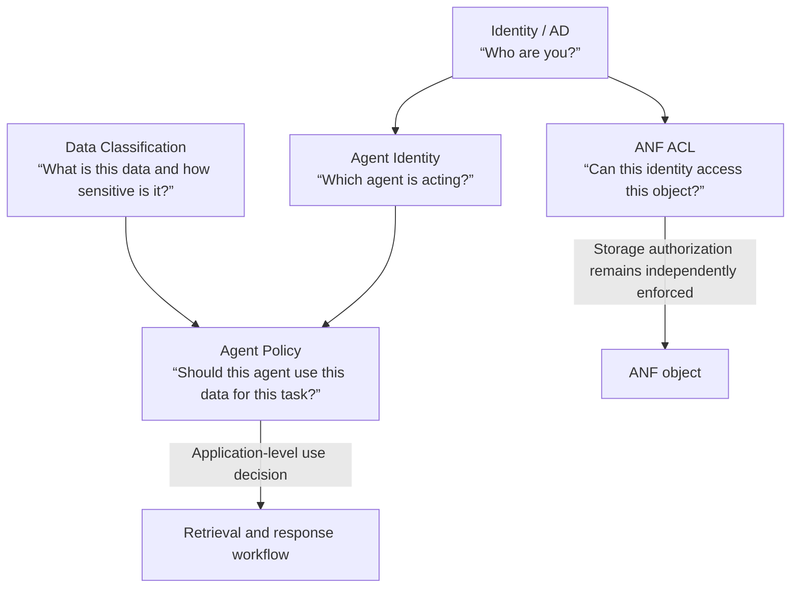
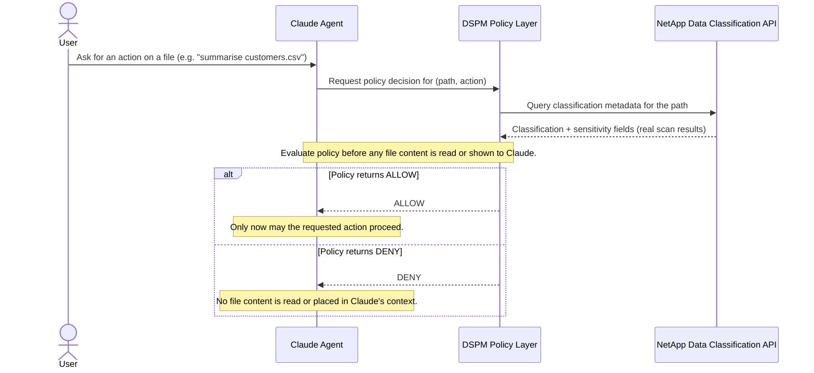
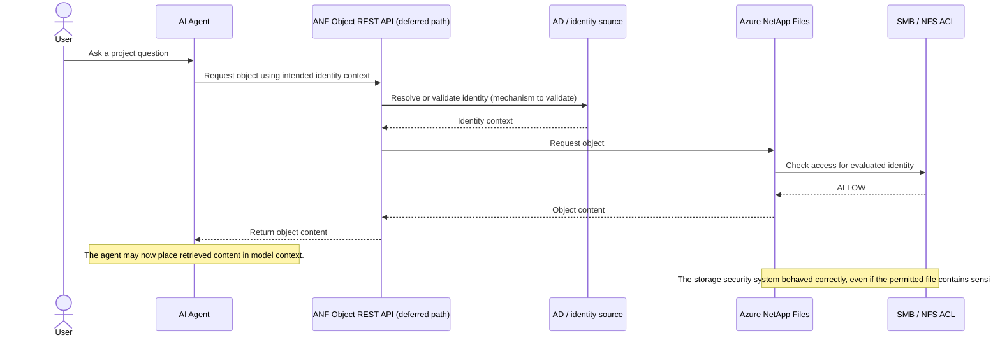
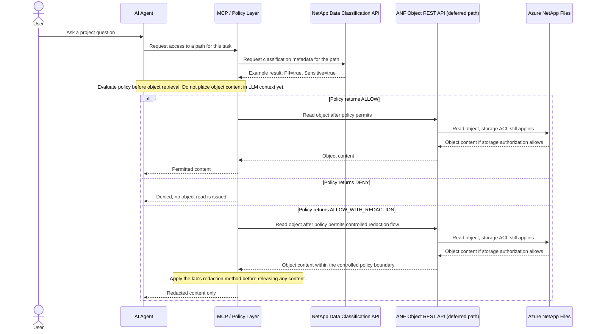

# ANF Agentic Data Security Lab

**Exploring data-aware access control for Agentic AI using Azure NetApp Files, NetApp Data Classification, MCP, and AI agents.**

> **Project status:** Design document for a proposed learning lab. This repository does not yet implement the architecture described here. Product capabilities and integration paths must be verified against current official documentation before implementation.

> **MVP scope (current focus):** The primary research question for the MVP is: *can NetApp Data Classification provide real data classification context through its API, and can a trusted DSPM-aware policy layer use that context to decide whether an AI agent action should be allowed?* The ANF Object REST API, SMB/NFS ACL integration, and identity impersonation are useful background concepts but are **not required dependencies** for the MVP. They remain documented as deferred/future extensions (see [Section 16](#16-future-ideas)). The MVP outcomes are limited to `ALLOW` and `DENY`; `ALLOW_WITH_REDACTION` is deferred.

## 1. Overview

Traditional storage security asks: **“Can this identity access this data?”**

Agentic AI adds a separate question: **“Should this agent use this data for this task?”**

An agent can discover, retrieve, combine, summarize, and act on enterprise information at machine speed. A file that is legitimately readable by the identity used for a request may still be inappropriate for a particular agent, task, or response. Once retrieved, information can be combined with other sources and included in model context, where it may influence generated content or be exposed through an answer.

This lab explores a design in which storage authorization remains in force, while data classification and an explicit agent policy add context before retrieval. The intended result is not a replacement for storage controls. It is a demonstration of how data sensitivity and task purpose could inform an additional application-level decision.

### Capability labels used in this document

- **Confirmed product capability** means a capability described by the relevant vendor's official documentation. Its applicability to a specific lab configuration still needs validation.
- **Lab design / proposed integration** means an architecture or behavior this project intends to investigate. It is not a statement that a product provides it natively.
- **Future / exploratory idea** means a possible later direction that must be researched before any capability is claimed.

## 2. Motivation

Consider a generic enterprise assistant with legitimate access to a project share. The underlying file ACL grants access to the identity used for the request. Some accessible files may nevertheless contain personally identifiable information (PII), sensitive personal information, confidential business information, financial information, or other restricted data.

If the agent retrieves one of those files, the storage security control may be working exactly as configured: the presented identity was allowed to read the object. The broader risk is that storage authorization alone does not express whether the agent should use that information for the current task, or whether the information should be returned to the user.

This is related to **Data Security Posture Management (DSPM)**: discovering and understanding sensitive data, its location, and its exposure or access context so an organization can assess and improve data security posture. In this lab, classification is treated as **data context** supplied to a separately designed policy layer. Classification is not assumed to authorize, deny, or intercept a read by itself.

## 3. Architecture

### MVP architecture (current scope)

The MVP architecture is deliberately narrow. It proves one thing: that real classification metadata from NetApp Data Classification's REST API can drive an `ALLOW` / `DENY` decision for an agent action, evaluated **before** any file content reaches the agent.



The policy decision considers, at minimum: the requested file/path, its classification, its sensitivity, and the requested action/purpose. The decision happens in the DSPM Policy Layer, before Claude is given any file content. There is no ANF Object REST API, SMB/NFS ACL check, or identity impersonation step in this MVP path — those concerns are deferred (see [Section 16](#16-future-ideas)).

### Extended architecture (background / deferred)

The original lab concept also explored an ANF-object-access path guarded by an MCP/policy layer, with the ANF ACL as a second, independent control. That design is retained here as background context and a possible future extension, not as an MVP dependency. The exact ANF object-read interface and identity propagation behavior would need separate validation if this path is pursued later.



If this path is built later, the policy check remains an application-level gate, and the underlying storage authorization must still be independently enforced for the identity actually used by the object-access path.

## 4. Security Responsibility Model

This full model is background context for how the controls relate to each other long-term. The MVP only implements and tests the **Data Classification** and **Agent Policy** layers; the ANF ACL, Identity/AD, and Agent Identity layers are deferred.



These controls answer different questions and are complementary. Identity establishes a subject; an agent identity can distinguish the software actor; an ACL governs access to a storage object; classification describes the data; and agent policy evaluates whether use is appropriate for a task. A policy decision must not be treated as proof that the storage ACL allowed access, and an ACL allow must not be treated as an agent-use decision.

## 5. Scenario A (MVP) — Classification-Aware Policy Decision

This is the scenario the MVP actually builds and tests. The policy decision happens **before** any file content reaches Claude. Only `ALLOW` and `DENY` are implemented in the MVP; `ALLOW_WITH_REDACTION` is shown as a deferred outcome.



Example decisions used to validate this flow:

| File | Classification | Requested action | Decision |
|---|---|---|---|
| `customers.csv` | PII | summarise | `DENY` |
| `product-info.txt` | normal | summarise | `ALLOW` |

## 6. Scenario B (Deferred) — ACL and Classification Together

The scenarios below describe the originally envisioned full architecture, combining storage ACLs with classification-aware policy. They are retained as background/future context and are **not** part of the MVP.

### Scenario B1 — ACL-only retrieval (deferred)



An ACL-only allow answers whether the evaluated identity may read the object. It does not, by itself, determine whether an agent should use the content for a specific task.

### Scenario B2 — Classification-aware retrieval through MCP (deferred)



The diagram's ordering is a **lab design proposal**, not a claim that NetApp Data Classification intercepts ANF reads or that MCP enforces this sequence automatically. If built, the final implementation should enforce ordering in trusted server-side code rather than depend on an LLM voluntarily calling tools in the intended order.

## 7. Sample Dataset

The proposed synthetic dataset is rooted at `/anf-vol1/Project-A/`. It is generated reproducibly by [scripts/New-LabDataset.ps1](scripts/New-LabDataset.ps1) rather than committed to the repository.

| File | Intended classification purpose |
|---|---|
| `control-clean.txt` | Negative control with no intentionally planted sensitive or personal data; baseline for comparison. |
| `product-info.txt` | Ordinary product descriptions and public-style information; baseline expected to be non-sensitive. |
| `public-announcement.txt` | Fictional public announcement; represents content normally safe for an agent to summarize. |
| `customers.csv` | Fabricated customer records with synthetic contact-like fields; test PII discovery and policy outcomes. |
| `employees.csv` | Fabricated employee records with synthetic personal or employment-related fields; test sensitive-personal-data classification. |
| `acquisition-plan.txt` | Fabricated confidential business strategy; test non-PII confidential-data handling. |

All sample values must be generated for this lab and safe for public publication. Do not use real people, customer records, employee records, production filenames containing sensitive information, or confidential business material. The expected classification purpose is a test intention, not a guarantee that a scanner will return a specific label; scanner behavior and classification results must be observed and documented.

For generator usage (mapped drive and UNC examples, `-Force` regeneration, and expected directory structure), see [sample-data/README.md](sample-data/README.md). For the test matrix distinguishing intended test signal from actual recorded scan results, see [docs/testing/dataset-test-plan.md](docs/testing/dataset-test-plan.md). An initial Data Classification UI baseline scan against this dataset was completed on 2026-10-01; see [Baseline Scan — 2026-10-01](docs/testing/dataset-test-plan.md#baseline-scan--2026-10-01).

Example MVP policy decisions for this dataset (to be validated against real scan results, not assumed in advance):

| File | Classification (expected) | Example action | Example decision |
|---|---|---|---|
| `product-info.txt` | normal | summarise | `ALLOW` |
| `customers.csv` | PII | summarise | `DENY` |
| `employees.csv` | sensitive personal data | summarise | `DENY` |
| `acquisition-plan.txt` | confidential (non-PII) | summarise | policy-dependent; document the actual outcome observed |

## 8. Component Responsibilities

MVP components (required to prove the core thesis):

| Component | Role | Security responsibility | Input | Output |
|---|---|---|---|---|
| Azure NetApp Files (ANF) | Hosts the synthetic lab dataset. Manually deployed. | Stores the files that will be scanned; no object-level API access is required for the MVP. | Synthetic files uploaded by the lab user. | Scanned volume content for NetApp Data Classification. |
| NetApp Data Classification | Scans the ANF dataset and classifies files. | Supplies data-security context; this lab does not treat it as a runtime authorization engine. | Configured data source (ANF volume) and scan configuration. | Classification metadata via its REST API (confirmed capability; see [Section 9](#9-data-classification-client-mcp-deferred)). |
| DSPM Policy Layer | Python component that evaluates `ALLOW` / `DENY` before Claude acts. | Trusted decision point; must run before any file content reaches Claude. | Requested path, classification metadata, sensitivity, and requested action/purpose. | `ALLOW` or `DENY` plus an audit decision. |
| Claude Agent | Interprets the user request and carries out only permitted actions. | Should receive a policy decision before acting; model behavior is not an enforcement boundary. | User request and the policy decision. | User-facing response. |
| Streamlit UI | Minimal chat interface for the lab. | Surfaces the policy decision to the user; not itself a security control. | User input and agent/policy output. | Rendered chat and visible ALLOW/DENY decision. |

Deferred components (background context, not required for the MVP):

| Component | Role | Status |
|---|---|---|
| ANF Object REST API | Proposed adapter-facing object access path. | Deferred; exact interface and support must be verified before use. |
| AD / Identity | Identity resolution and impersonation for storage access. | Deferred. |
| SMB/NFS ACL integration | Storage-level access control. | Deferred; assumed to keep functioning independently if ever integrated. |
| MCP | Standardized tool-exposure interface. | Deferred; the MVP calls the policy layer directly from Python rather than through an MCP server. |
| DII (future phase) | Possible future observability/context integration (NetApp Data Infrastructure Insights, subject to confirmation). | Deferred/exploratory; no capability claimed. |

## 9. Data Classification Client (MCP deferred)

The MVP does not require an MCP server. Claude is integrated through the Anthropic API, and the DSPM Policy Layer calls NetApp Data Classification's REST API directly from Python. The two logical operations are:

| Operation | Purpose |
|---|---|
| `get_data_classification(path)` | Query NetApp Data Classification's REST API for classification/sensitivity metadata about a path, before any action is taken on that path. The exact endpoint, authentication, and response schema must be confirmed against the deployed instance's own API documentation (see [Section 11, Milestone 0](#milestone-0--data-classification-api-validation-do-this-first)) rather than assumed. |
| `evaluate_policy(path, classification, action)` | Apply the DSPM policy rules (see [Section 10](#10-policy-model)) to decide `ALLOW` or `DENY` before Claude performs the requested action. |

Exposing these operations as MCP tools, and adding `read_anf_object(path)` for object retrieval, are **future ideas** (see [Section 16](#16-future-ideas)), not MVP requirements. If MCP is added later, the policy evaluation should still be enforced in trusted server-side code rather than left to the LLM to call tools in the correct order voluntarily.

## 10. Policy Model

The MVP implements only two outcomes:

- **`ALLOW`** — policy permits the requested action.
- **`DENY`** — policy blocks the requested action; Claude does not receive the file content.

`ALLOW_WITH_REDACTION` is **deferred** (see [Section 16](#16-future-ideas)). It is documented below for completeness but is not implemented in the MVP.

Example pseudocode:

```text
# LAB POLICY: illustrative rules, not a NetApp product feature.

IF classification == "normal":
    ALLOW

IF PII == true AND agent_not_authorised_for_pii:
    DENY

# Deferred — not implemented in the MVP:
# IF PII == true AND limited_use_allowed:
#     ALLOW_WITH_REDACTION

OTHERWISE:
    DENY
```

Classification labels and flags must be mapped from verified product output into lab policy inputs. Missing, stale, ambiguous, or unavailable classification should fail closed to `DENY` in the MVP; the lab must document that choice. The policy decision must occur **before** sensitive content is provided to Claude.

## 11. Implementation Phases

### Milestone 0 — Data Classification API validation (do this first)

Before building the Claude agent or the Streamlit UI, validate this chain for one synthetic file stored on ANF:

```text
NetApp Data Classification
        |
        | REST API
        v
Python client
        |
        v
Real classification metadata
```

Requirements for this milestone:

- Do not invent the API endpoint, authentication method, or JSON schema.
- Use current official NetApp documentation: [NetApp Data Classification APIs](https://docs.netapp.com/us-en/data-services-data-classification/api-classification.html) and the authentication reference it links to, [Get identifiers](https://docs.netapp.com/us-en/bluexp-automation/platform/get_identifiers.html).
- After deploying the instance, retrieve its own OpenAPI/Swagger definition at `https://<classification_ip>/documentation` and use it as the authoritative source for the real query endpoint and schema (the public docs show example endpoints such as `/api/{classification_version}/search/options` and `/api/{classification_version}/actions`, but the specific per-file classification query must be confirmed against the live instance).
- Record, in `docs/deployment/06-data-classification-api.md`: the exact API endpoint(s) used, the authentication method (bearer token plus the `x-agent-id` header shown in official examples), the request made, the response fields returned (for example personal-data, sensitive-personal-data, and sensitivity-level fields), and any limitations observed.
- Do not proceed to Phase 2 until this milestone produces real classification metadata for at least one synthetic file.

### Phase 1 — Data Foundation

1. Deploy Azure NetApp Files manually.
2. Create the synthetic test files on ANF (see [Section 7](#7-sample-dataset)).
3. Deploy NetApp Data Classification manually.
4. Scan the ANF dataset.
5. Verify the classification results in the Data Classification UI. **Done 2026-10-01** — see [Baseline Scan — 2026-10-01](docs/testing/dataset-test-plan.md#baseline-scan--2026-10-01).
6. Query those real classification results through the Data Classification API (Milestone 0, above). **Next step, not yet done.**

### Phase 2 — Secure Agent

7. Build a simple Python DSPM policy engine that implements `ALLOW` / `DENY` using the real classification metadata from Phase 1.
8. Integrate Claude through the Anthropic API, so the policy decision runs before Claude receives file content.
9. Build a minimal Streamlit chat interface demonstrating policy decisions.
10. Show the security decision (`ALLOW` or `DENY`, with the reason) in the UI.

### Phase 3 — Observability and Context (exploratory, deferred)

Explore the proposed relationship:

```text
ANF -> DII -> MCP -> AI Agent
```

This phase is **exploratory**. It must not claim an integration, data flow, monitoring signal, or security capability unless that behavior is confirmed by current official documentation and validated in the lab. Define what DII means in the selected product context and what information, if any, can appropriately reach an agent before implementing this phase.

### Deferred for later (documented as future extensions only)

- ANF Object REST API
- SMB/NFS ACL integration
- Identity impersonation
- `ALLOW_WITH_REDACTION`
- DII
- Advanced identity policy
- Production policy engines

## 12. Repository Structure

The following is a proposed structure, not a statement of files already implemented:

```text
anf-agentic-data-security-lab/
|
|-- README.md
|-- docs/
|   |-- architecture.md
|   |-- concepts/
|   |   |-- dspm.md
|   |   `-- agentic-ai-data-security.md
|   |
|   |-- deployment/
|   |   |-- 01-prerequisites.md
|   |   |-- 02-deploy-anf.md
|   |   |-- 03-configure-anf-object-api.md
|   |   |-- 04-deploy-data-classification.md
|   |   |-- 05-scan-anf.md
|   |   |-- 06-data-classification-api.md
|   |   `-- 07-run-agent-lab.md
|   |
|   |-- security/
|   |   |-- threat-model.md
|   |   `-- policy-model.md
|   |
|   |-- testing/
|   |   `-- dataset-test-plan.md
|   |
|   `-- troubleshooting.md
|
|-- scripts/
|   `-- New-LabDataset.ps1
|
|-- src/
|   |-- agent/              # Claude integration via the Anthropic API
|   |-- policy/              # DSPM policy engine (ALLOW / DENY for MVP)
|   |-- ui/                  # Streamlit chat interface
|   |-- mcp/                 # deferred: MCP server wrapper, not required for MVP
|   `-- adapters/
|       |-- data_classification/   # Data Classification API client (MVP)
|       `-- anf/                   # deferred: ANF Object REST API adapter
|
|-- sample-data/
|   `-- README.md
|
|-- tests/
|-- .env.example
|-- .gitignore
`-- LICENSE
```

## 13. Deployment Model

Azure NetApp Files and NetApp Data Classification will be **manually deployed by the lab user**. The repository will provide step-by-step deployment and configuration guidance, but will not automatically provision these services unless that is explicitly requested in a later project decision.

Deployment instructions should state prerequisites, region and service availability considerations, required permissions, expected costs, cleanup steps, and safe handling of credentials. No credentials or secrets belong in the repository; `.env.example` should contain placeholder names only.

## 14. What This Lab Is NOT

This lab does **not** claim that:

- ANF ACLs are insufficient or insecure.
- NetApp Data Classification is a runtime authorization engine.
- Data Classification automatically intercepts ANF Object API requests.
- MCP itself provides DSPM.
- NetApp currently provides the complete policy architecture shown in this document.
- The ANF Object REST API, SMB/NFS ACL integration, or identity impersonation are required to prove the MVP's core thesis — they are deferred, background concepts.

Instead, the lab explores how existing capabilities and APIs could be composed into a data-aware Agentic AI architecture. The proposed integration is a lab design, and each product capability and interface must be verified before it is described as supported.

## 15. Learning Objectives

By completing the lab, a reader should understand:

- NetApp Data Classification's REST API: how to authenticate, query, and interpret real classification metadata for a file.
- Data classification and DSPM concepts.
- Why pre-retrieval (pre-action) policy enforcement matters for agentic AI.
- Data leakage considerations when content enters model context.
- The distinction between authentication, authorization, classification, and AI policy.
- How a simple DSPM policy engine can turn classification metadata and a requested action into an `ALLOW` / `DENY` decision.
- Why ANF Object REST API, SMB/NFS ACLs, and identity impersonation are a separate, complementary concern deferred from the MVP (see [Section 16](#16-future-ideas)).

## 16. Future Ideas

Potential extensions, each requiring its own capability and threat-model review:

- ANF Object REST API integration (deferred from MVP).
- SMB/NFS ACL integration (deferred from MVP).
- Identity impersonation (deferred from MVP).
- `ALLOW_WITH_REDACTION` (deferred from MVP).
- DII MCP integration.
- Explicit agent identity.
- Human-to-agent delegated identity.
- Richer, production-grade policy engines and policy administration.
- Microsoft Purview integration.
- Auditable policy and retrieval trails.
- Agent behavior monitoring.
- Prompt-injection testing.
- Multi-agent access and delegation.
- Policy decisions based on task or purpose.

## Official Documentation to Verify

These vendor documentation entry points are starting points for implementation research, not evidence that every proposed integration is supported. Confirm the specific product version, feature availability, API contract, identity behavior, and licensing in scope before coding. Do not infer an object-content API from management API documentation.

**Confirmed and directly relevant to Milestone 0:**

- [NetApp Data Classification — Learn about Data Classification](https://docs.netapp.com/us-en/data-services-data-classification/concept-classification.html): deployment model, supported data sources (confirms Azure NetApp Files is supported), and scanning concepts.
- [NetApp Data Classification APIs](https://docs.netapp.com/us-en/data-services-data-classification/api-classification.html): **confirmed** that a REST API exists, covering Investigation, Compliance, Governance, and Configuration areas; confirms the instance exposes its own Swagger/OpenAPI reference at `https://<classification_ip>/documentation`; shows example endpoint and header shapes (`/api/{classification_version}/search/options`, `/api/{classification_version}/actions`, `Authorization: Bearer ...`, `x-agent-id`). The exact endpoint and schema for querying a single file's classification must still be confirmed against the deployed instance's own Swagger reference.
- [Get identifiers (authentication reference linked from the API page)](https://docs.netapp.com/us-en/bluexp-automation/platform/get_identifiers.html): authentication method used by the Data Classification API.
- [FAQ for NetApp Data Classification](https://docs.netapp.com/us-en/data-services-data-classification/faq-data-classification.html): confirms the REST API exists, confirms data is accessed via authenticated, encrypted API calls, and lists supported file types for PII detection.

**Background, for the deferred ANF object-access / ACL path:**

- [Azure NetApp Files documentation](https://learn.microsoft.com/azure/azure-netapp-files/): service concepts, supported protocols, identity integration, access controls, and deployment requirements.
- [Azure NetApp Files REST API reference](https://learn.microsoft.com/rest/api/netapp/): determine whether the documented operations are management-plane operations or provide the object access that a future, deferred phase might require. Do not assume a management API reads file contents.
- [Azure NetApp Files NFS and SMB documentation](https://learn.microsoft.com/azure/azure-netapp-files/): locate and verify the current protocol-specific guidance for ACL behavior and identity mapping, only if the deferred path is pursued later.
- [Model Context Protocol specification](https://modelcontextprotocol.io/specification): protocol concepts, tool behavior, and security considerations, only if the deferred MCP integration is pursued later.
- [NetApp Data Infrastructure Insights documentation](https://docs.netapp.com/us-en/data-infrastructure-insights/): only if the exploratory Phase 3 proceeds; validate the proposed DII role and any supported integration surface.
- [Microsoft Purview documentation](https://learn.microsoft.com/purview/): only if a future Purview integration is explored; confirm the relevant data-security capability and supported interfaces.

Before Phase 1, complete Milestone 0 and record the exact API endpoint, authentication method, request, and response fields observed from the deployed Data Classification instance. If the metadata interface cannot be confirmed, revise the architecture before implementation rather than inventing endpoints or payload schemas.
