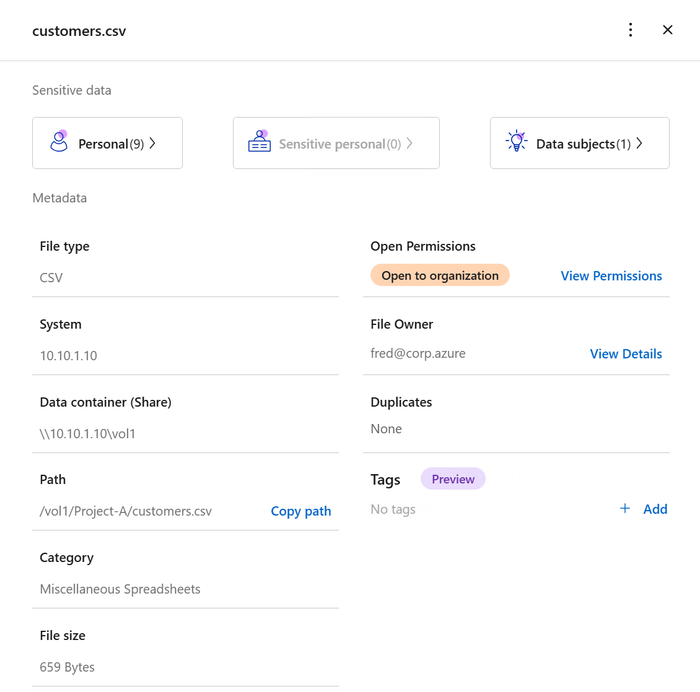
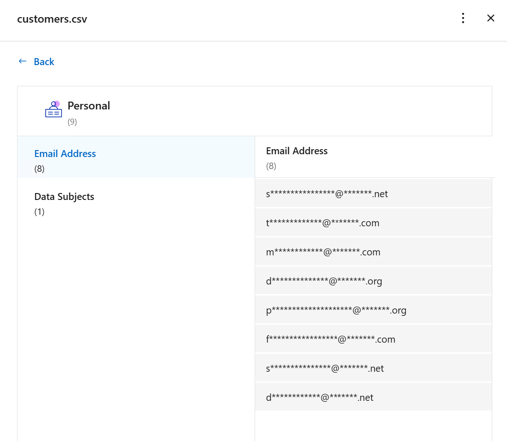
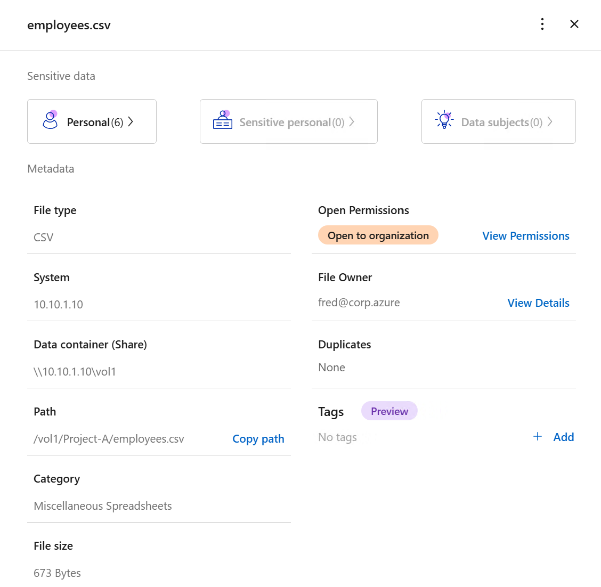
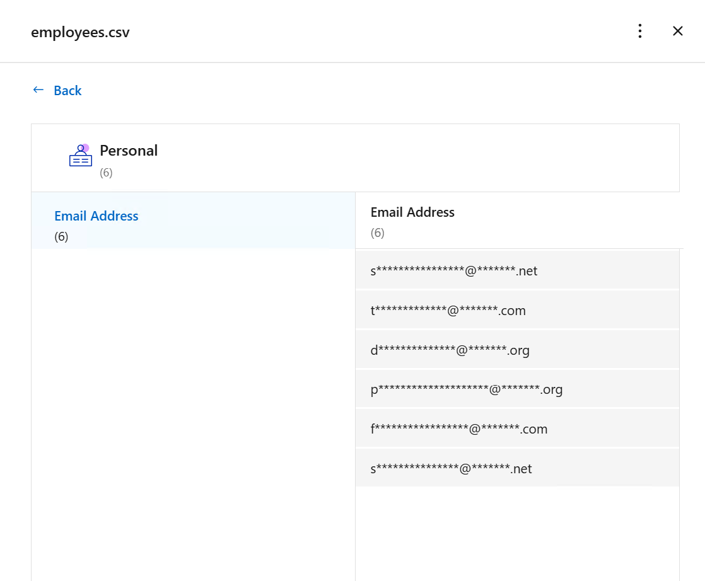
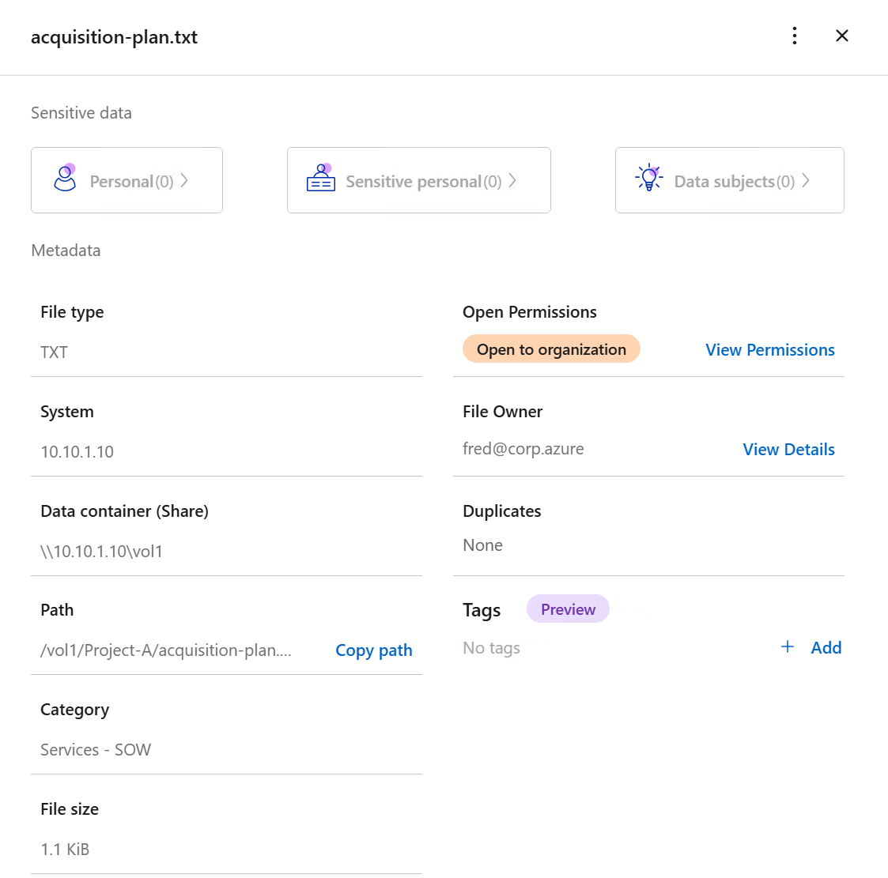
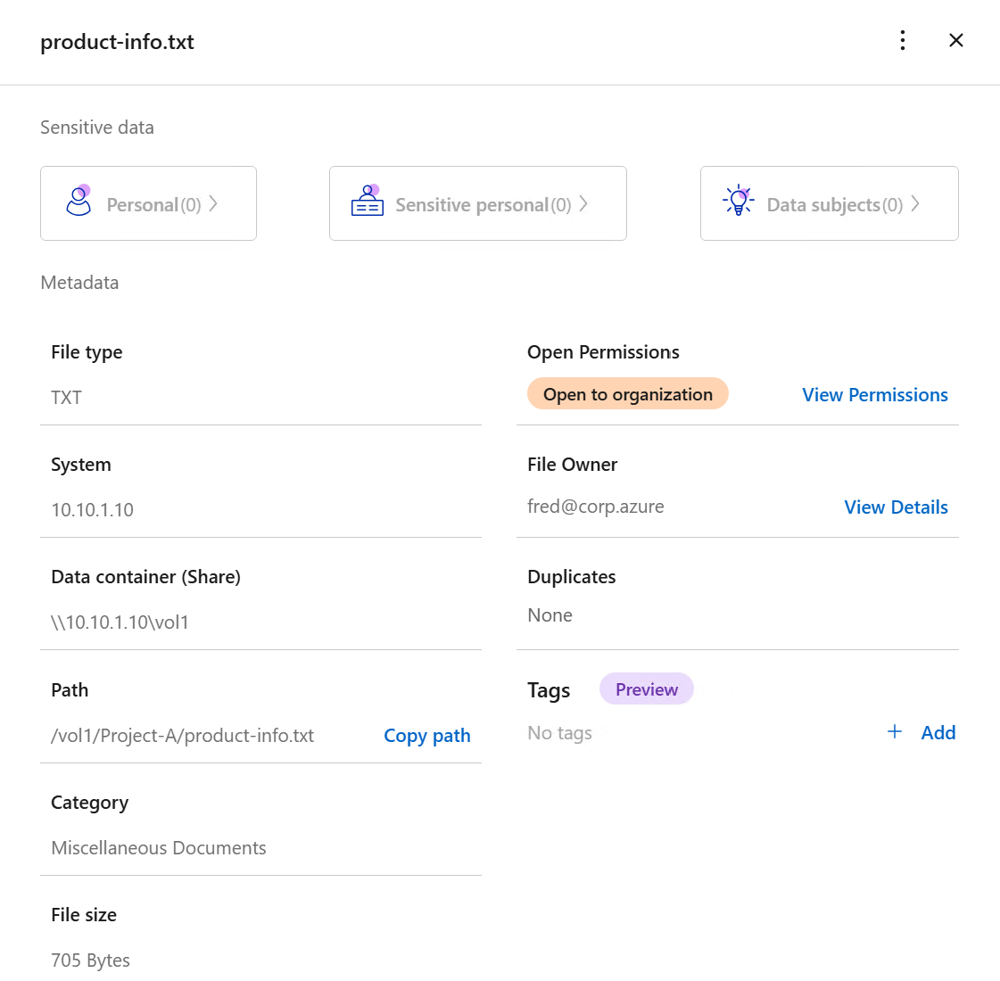
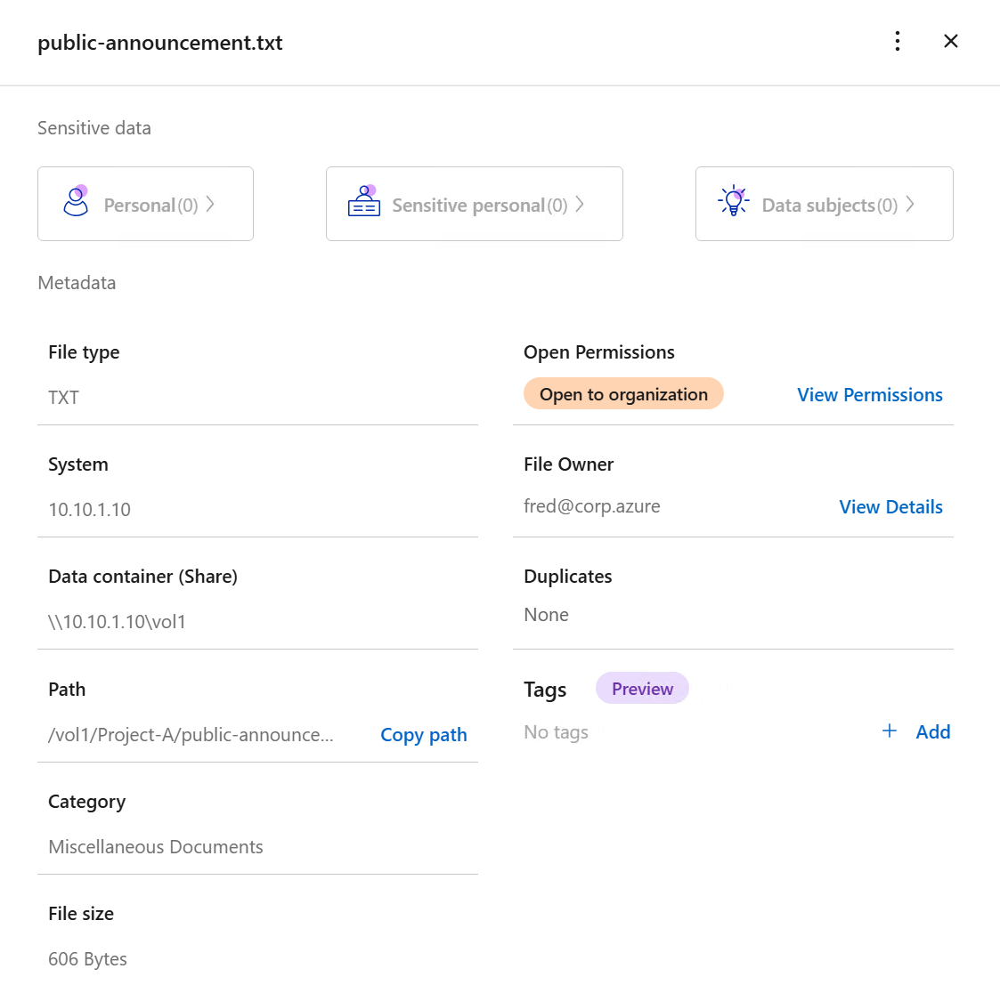
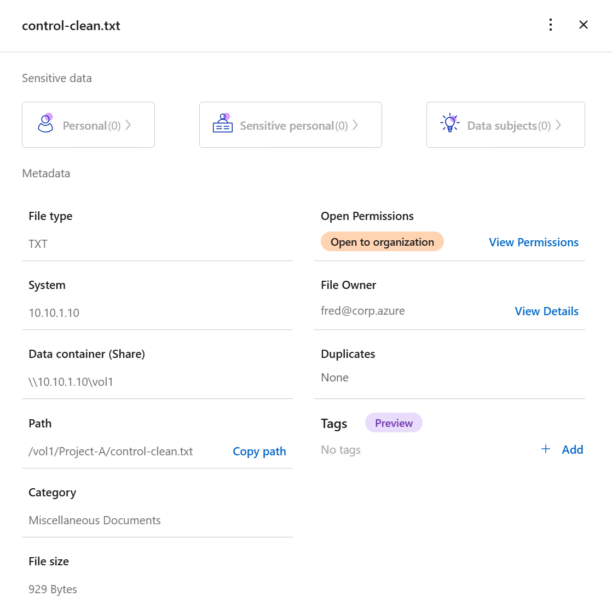

# Dataset Test Plan — NetApp Data Classification Scan

This plan defines what we intend to observe when NetApp Data Classification
scans the synthetic dataset generated by
[scripts/New-LabDataset.ps1](../../scripts/New-LabDataset.ps1) (documented in
[sample-data/README.md](../../sample-data/README.md)). It does not implement
anything; it is the record of intent versus observed result for Milestone 0
and Phase 1 of the main [README.md](../../README.md#11-implementation-phases).

## How to use this document

For each file, the **Intended Test Signal** column states what the file was
designed to probe. It is a hypothesis, not a claim about product behavior.
The **Actual Result** column is filled in only after a real scan has been run
and the results reviewed in the Data Classification UI or API — never assumed
or pre-filled in advance. The first baseline scan results are recorded below
in the Test matrix and in [Baseline Scan — 2026-10-01](#baseline-scan--2026-10-01).

## Test matrix

| File | Test Purpose | Intended Test Signal | Actual Result | Notes |
|---|---|---|---|---|
| `control-clean.txt` | negative-control | No intentionally planted sensitive or personal data; expect a clean/baseline classification. | Personal: 0, Sensitive Personal: 0, Data Subjects: 0, Category: Miscellaneous Documents, Open Permissions: Open to organization | No planted sensitive-data signal was detected, as expected for the negative control. |
| `product-info.txt` | normal-business-data | Ordinary, non-sensitive product information; expect no PII or confidentiality flags. | Personal: 0, Sensitive Personal: 0, Data Subjects: 0, Category: Miscellaneous Documents, Open Permissions: Open to organization | No personal or sensitive-personal classification was observed. Candidate for a future lab policy `ALLOW` test, but `ALLOW`/`DENY` is a lab policy decision, not a NetApp Data Classification output. |
| `public-announcement.txt` | public-information | Public-style business announcement; expect no PII or confidentiality flags. | Personal: 0, Sensitive Personal: 0, Data Subjects: 0, Category: Miscellaneous Documents, Open Permissions: Open to organization | No personal or sensitive-personal classification was observed. |
| `customers.csv` | pii-detection | Synthetic personal/contact-like information (name, email, phone, location); observe whether and how these fields are flagged as PII. | Personal: 9 (Email Address: 8), Sensitive Personal: 0, Data Subjects: 1, Category: Miscellaneous Spreadsheets, Open Permissions: Open to organization | The UI explicitly showed Email Address detections only. Do not claim names, phone numbers, cities, or states were detected unless later evidence confirms this. Do not interpret "Data Subjects: 1" beyond what the UI reports; do not assume it means exactly one individual unless confirmed against official NetApp documentation. |
| `employees.csv` | employee-personal-data | Synthetic personal/employment information; observe whether and how these fields are flagged as personal or sensitive personal data. | Personal: 6 (Email Address: 6), Sensitive Personal: 0, Data Subjects: 0, Category: Miscellaneous Spreadsheets, Open Permissions: Open to organization | Email Address was the only observed Personal classification. Do not claim names, phone numbers, departments, or job titles were classified as personal data unless later evidence confirms this. |
| `acquisition-plan.txt` | confidential-business-data-experiment | Fictional business-sensitive narrative with no PII; observe whether/how business-sensitive context is classified. No assumption is made that this will be labeled confidential. | Personal: 0, Sensitive Personal: 0, Data Subjects: 0, Category: Services - SOW, Open Permissions: Open to organization | Deliberately written as fictional confidential acquisition information, but the standard result did not show Personal or Sensitive Personal classification. Do not describe this file as classified "Confidential" by NetApp Data Classification; intended business confidentiality and observed classification metadata are not necessarily the same thing. |

## Baseline Scan — 2026-10-01

- **ANF share:** `\\10.10.1.10\vol1`
- **Dataset path:** `\\10.10.1.10\vol1\Project-A` (shown in the Data Classification UI as `/vol1/Project-A/<filename>`)
- **Dataset generator:** [scripts/New-LabDataset.ps1](../../scripts/New-LabDataset.ps1) (unmodified)
- **Scan method:** NetApp Data Classification
- **Validation method:** Manually verified through the NetApp Data Classification UI
- **Per-file results:** see the Test matrix above (Actual Result / Notes columns)

### Limitations

- Results were observed only through the Data Classification UI for this baseline; the REST API has not yet been queried (see [Next Validation Milestone](#next-validation-milestone)).
- Only the fields shown in the UI summary (Personal, Sensitive Personal, Data Subjects, Category, Open Permissions, Path, and the Personal-detail breakdown shown) were recorded. Other fields the product may report were not reviewed and are not claimed here.
- "Data Subjects" is recorded verbatim as shown in the UI; its precise meaning has not been confirmed against official NetApp documentation.
- These results reflect one scan of one synthetic dataset at one point in time. They are observations about this specific lab dataset, not general claims about NetApp Data Classification's detection capabilities.

## Evidence

Screenshots below are from the NetApp Data Classification UI for the 2026-10-01
baseline scan. They support the Test matrix and Baseline Scan sections above;
the table remains the concise summary and these images are supporting detail,
not a replacement for it.

### customers.csv





### employees.csv





### acquisition-plan.txt



### product-info.txt



### public-announcement.txt



### control-clean.txt



## Baseline Findings

**Finding 1 — PII-oriented files produced Personal classification results.**
`customers.csv` (Personal = 9) and `employees.csv` (Personal = 6) both showed non-zero Personal classification, while the clean baseline files (`control-clean.txt`, `product-info.txt`, `public-announcement.txt`) all showed Personal = 0.

**Finding 2 — Personal and Sensitive Personal are distinct observed signals.**
Both PII-oriented files showed Personal detections but Sensitive Personal = 0 in both cases.

**Finding 3 — Human/business intent and scanner-observed classification are not necessarily the same thing.**
`acquisition-plan.txt` was intentionally written as confidential business content, but the observed standard result was Personal = 0, Sensitive Personal = 0, Category = Services - SOW. This is an important experimental finding for the lab, not a product deficiency claim.

**Finding 4 — All six reviewed files showed Open Permissions = Open to organization.**
This is recorded as observed metadata only. No policy rules are based on this field yet.

**Finding 5 — The lab must continue to distinguish intended test signal from actual result.**
The actual scanner/API metadata remains authoritative for future policy experiments; the intended test signal is a hypothesis recorded in advance, not a result.

## Next Validation Milestone

The next milestone is **not** another UI-based test. It is the first programmatic validation of the Data Classification REST API, per [README.md Milestone 0](../../README.md#milestone-0--data-classification-api-validation-do-this-first):

```text
NetApp Data Classification
        |
        | REST API
        v
Python client
        |
        v
Real classification metadata
```

First API validation target: `/vol1/Project-A/customers.csv`.

Success criteria:

1. Query real Data Classification metadata programmatically.
2. Identify the exact supported API endpoint and authentication method from current official NetApp documentation and the deployed instance's live Swagger reference.
3. Retrieve metadata that can be correlated to `customers.csv`.
4. Compare the API result with the manually verified UI baseline recorded above.
5. Record the exact API fields and values returned.
6. Do not invent fields or translate undocumented fields into policy semantics.
7. Do not begin Claude or Streamlit work until this milestone succeeds.

## Explicit distinction

- **Intended Test Signal** — what this lab designed the file to probe. Documented in advance.
- **Actual NetApp Data Classification Result** — what the product actually reports after a real scan. Recorded only after scanning, in this document.

These two columns must never be conflated. A mismatch between them is itself
a useful and expected lab finding, not an error to be corrected by editing
the intended signal after the fact.
